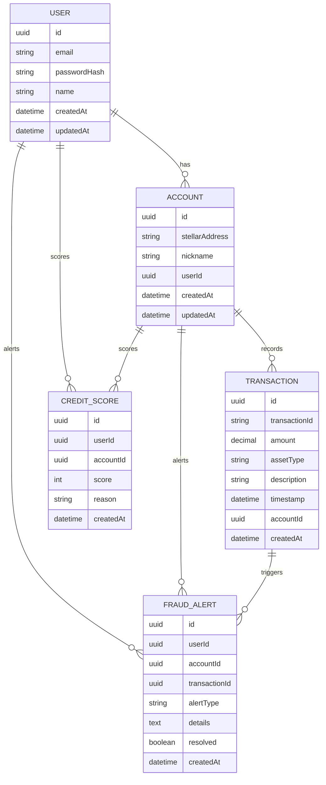

# Entity Relationship Diagram (ERD)

## Relationships
- User has many Accounts
- Account has many Transactions
- User and Account have many CreditScores
- User, Account, and Transaction have many FraudAlerts

## Indexes
- Unique index on User.email
- Index on Account.stellarAddress
- Index on Transaction.transactionId
- Indexes on foreign keys for fast lookups
