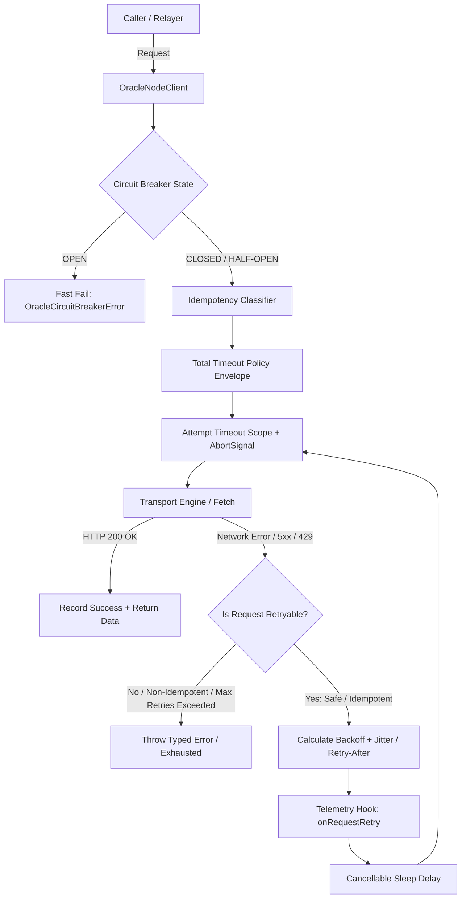

# Oracle Node Resilience Architecture

## Overview

The Oracle Node network is a mission-critical subsystem in `chenaikit`, responsible for data aggregation, consensus round observation, cryptographic attestation, and publishing off-chain feeds onto Soroban smart contracts.

Network calls between application consumers, backend relayers, and oracle validator nodes operate over potentially unreliable network boundaries. Transient network failures, connection resets, downstream node restarts, and rate limit throttling require resilient retry and timeout policies without introducing dangerous non-idempotent duplicate transactions.

---

## Key Resilience Pillars

### 1. Operation Classification & Idempotency Boundary
- **Read-Only / Safe Operations**: Queries to `/health`, `/api/v1/status`, `/api/v1/feeds/:id`, `/rounds/latest`, `/attestations/:id`, and `/metrics` are marked `read-only-safe`. They are guaranteed free of side effects and can be retried across any transient network failure.
- **Mutating Operations**: Submissions such as `submitReport`, `commitPrice`, `signAttestation`, and `postOracleData` are marked `non-idempotent`.
- **Idempotency Protection**: Mutating operations are **never** automatically retried unless an `Idempotency-Key` or `idempotencyKey` token is explicitly provided by the caller.

### 2. Bounded Exponential Backoff with Jitter
Backoff uses bounded mathematical progression to avoid synchronized thundering herd spikes:

$$\text{delay} = \min(\text{maxDelay}, \text{initialDelay} \times \text{factor}^{(\text{attempt} - 1)})$$

When Jitter is enabled (`full` mode):
$$\text{sleep} = \text{random}(0, \text{delay})$$

### 3. Dual-Level Timeout Strategy
1. **Per-Attempt Timeout**: Prevents hanging sockets or unresponsive TCP handshakes from blocking an individual HTTP request (default: 5000ms).
2. **Cumulative Total Timeout**: Provides a strict maximum deadline budget for an entire multi-attempt retry loop.

### 4. Circuit Breaker Protection
When downstream oracle nodes experience prolonged outages:
- After `failureThreshold` consecutive failures (default: 5), state shifts from `CLOSED` to `OPEN`.
- In `OPEN` state, calls are immediately fast-failed with `OracleCircuitBreakerError` without generating network traffic.
- After `cooldownPeriodMs` (default: 30000ms), state transitions to `HALF-OPEN` to test node recovery with trial requests before fully closing.

### 5. Standardized Error Hierarchy
All error paths produce typed instances inheriting from `OracleError`:
- `OracleTimeoutError`: Contains `timeoutMs`, `operationName`, `attempt`, `isTotalTimeout`.
- `OracleHttpError`: Contains HTTP `status`, `statusText`, `headers`, and parsed `responseBody`.
- `OracleRateLimitError`: Contains parsed `retryAfterMs` delay.
- `OracleNetworkError`: Contains `originalError` and destination `url`.
- `OracleRetryExhaustedError`: Contains array of all attempt errors and `totalDurationMs`.
- `OracleCircuitBreakerError`: Contains `cooldownRemainingMs`.
