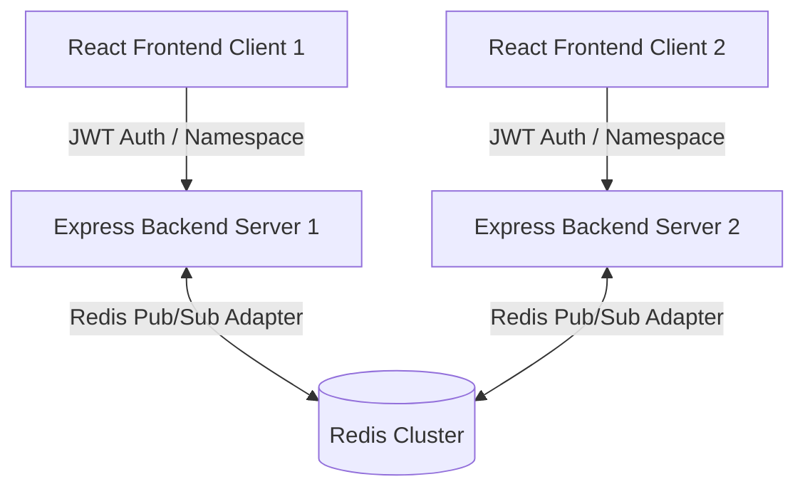

# Real-Time WebSocket Event Architecture

## System Overview

ChenAIKit features a high-performance, resilient real-time event system built with **Socket.IO**, **Express**, **JWT Authentication**, and **Redis Pub/Sub** horizontal scaling.



---

## Namespaces & Event Contracts

Connections are split across dedicated Socket.IO namespaces to isolate traffic and manage access controls efficiently:

### 1. `/alerts` (Security & Fraud Alerts)
- **Authentication**: JWT Required
- **Rooms**: `user:<userId>`, `role:admin`
- **Events**:
  - `alert:new`: Triggered when a new fraud/security alert occurs.
  - `alert:update`: Alert status updates.

### 2. `/scores` (Credit Score Updates)
- **Authentication**: JWT Required
- **Rooms**: `user:<userId>`
- **Events**:
  - `score:updated`: User-specific real-time credit score recalculation update.
  - `score:recalculated`: Platform-wide score update notification.

### 3. `/transactions` (Live Transaction Feed & System Metrics)
- **Authentication**: JWT Required
- **Rooms**: `user:<userId>`
- **Events**:
  - `transaction:new`: Live transaction stream.
  - `transaction:analyzed`: Completed risk analysis event.
  - `metrics:update`: Real-time platform throughput (TPS) & latency metrics.

---

## Connection Lifecycle & JWT Handshake

1. **Client Handshake**: Client passes JWT access token in `auth: { token: "<jwt_access_token>" }`.
2. **Authentication Middleware**: Socket.IO middleware calls `verifyAccessToken(token)`.
   - If valid: Attach `socket.data.user = decodedUser` and auto-join room `user:<userId>`.
   - If invalid/missing: Connection is immediately rejected with an `Authentication error`.
3. **Heartbeat / Resilience**:
   - Server configures `pingInterval: 25000` (25s) and `pingTimeout: 20000` (20s).
   - Application-level `ping` -> `pong` response supported for client health verification.
4. **Offline Queueing & Reconnection**:
   - Frontend `WebSocketProvider` buffers messages sent while offline into a queue.
   - Upon reconnection, pending messages are automatically flushed to the server.
5. **Deduplication**:
   - Events track unique `eventId` or hash digests to prevent duplicate UI state rendering during reconnection buffer flushes.

---

## Multi-Instance Scaling with Redis Adapter

To scale horizontally across multiple backend container instances:
- `@socket.io/redis-adapter` attaches `pubClient` and `subClient` using `ioredis`.
- Events emitted on one server instance are published to Redis and broadcast to clients connected to any other server instance seamlessly.
- Local development without Redis gracefully falls back to an in-memory adapter.

### Local Development / Scaling Commands
```bash
# Run multi-instance backend scaling with Redis
docker compose -f backend/docker-compose.ws-scale.yml up
```
